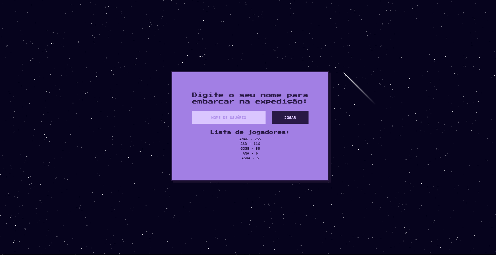
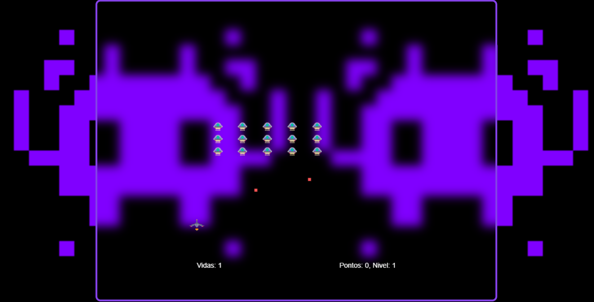

# Space Invaders

Este é um projeto amador, cujo o intuito é melhorar de um código inicial inspirado no jogo "Space invaders". Foi desenvolvido para a conclusão do projeto proposto na disciplina de Raciocínio lógico algoritmico, na universidade de fortaleza.

## Autores

- [@Ana Gabriela](https://github.com/AnaGabrielaDev)
- [@Felipe Cassiano](https://github.com/Shinzou27)
- [@Victor Kauan](https://github.com/victorkauan)
- @Iandra Gabriele
- @Lucas Henrique

## 🔗 Link projeto em produção

[](https://anagabrieladev.github.io/space-invaders-game/)

## Demonstração




## Rodando localmente

Clone o projeto

```bash
  https://github.com/AnaGabrielaDev/space-invaders-game
```

Entre no diretório do projeto

```bash
  cd space-invaders-game
```

Inicie o servidor

```bash
  pode usar a extensão "live server" disponivel no vscdode
```

## Stack utilizada

**Front-end:** HTML, SCSS, CSS

**Back-end:** Vanilla ES6

## Referência

- [Space Invaders](https://en.wikipedia.org/wiki/Space_Invaders)
- [Musica Intro](https://www.youtube.com/watch?v=9aKIkh4gfqs&ab_channel=CharlieAxlTebbutt)
- [Musica Fundo](https://www.youtube.com/watch?v=ftBS1JZQDjA&feature=youtu.be&ab_channel=TOMZM15)
